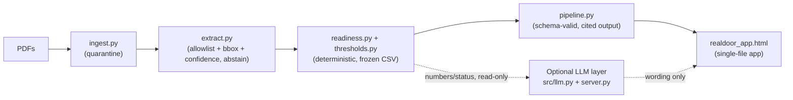

# Architecture & Risk Note

RealDoor (RealPage x Hack-Nation Challenge 03). This is the short, standalone
synthesis the brief asks for — see `README.md` for the full walkthrough and
`MODEL_DISCLOSURE.md` for the complete model/tooling accounting.

## 1. Architecture at a glance

```
24 synthetic PDFs (16 text-layer, 8 rasterized)
         |
         v
  src/ingest.py        untrusted-document load; embedded-instruction
                        regex scan -> quarantine (output/quarantine_log.jsonl);
                        rasterization auto-detected as a cross-check
         |
         v
  src/extract.py        allowlisted fields only (FIELD_SPECS); each field
                        carries page + bbox + confidence; abstains (never
                        guesses) on unparseable/missing values; OCR path if
                        available, else a logged, confidence-0.60
                        gold_fallback (never silent)
         |
         v
  src/readiness.py       reconciles pay-stub components, currency-checks
  + src/thresholds.py    supporting docs (60-day rule), calls the shipped
  + src/shipped.py       starter/src/calculate.py (annualize / compare_to_
                        threshold, byte-for-byte unmodified) against the
                        frozen CSV threshold table -> comparison + reason
                        codes, never a decision
         |
         v
  src/pipeline.py         assembles a schema-valid submission.json (citations,
                        comparison enum, readiness_status enum) + a richer
                        profile.json for the UI
         |
         v
  realdoor_app.html      single self-contained, theme-aware, WCAG-2.2-AA-
                        pattern file; renders entirely from the embedded
                        output/profiles/all_profiles.json data blob
```



**Trust boundary.** Everything left of the dashed line is the deterministic
engine, and it is the *only* source of numbers, thresholds, comparisons, and
`readiness_status`. The optional LLM layer (`src/llm.py`, `server.py`)
sits strictly behind it: it can reword a profile's already-computed facts
into plain English, and nothing more. It never annualizes, never looks up a
threshold, never emits a status. Every `/api/ask` request in `server.py`
passes through `src.rules_qa.classify_and_respond` before OpenAI is ever
called, and any model output that still slips a forbidden word is discarded
by `src/llm.py::_guard` (`FORBIDDEN_RE`) and replaced with a deterministic,
templated fallback — the app is fully usable, and identically correct, with
zero API key configured.

## 2. Key design decisions & why

- **Build on the shipped starter unmodified.** `starter/src/calculate.py`,
  `rules.py`, `load_documents.py`, the schemas, the gold fixtures, and the
  frozen threshold CSV are loaded byte-for-byte via `src/shipped.py` — the
  scored arithmetic and lookups can never drift from what the organizer
  provides, and a hidden test that ships a corrected CSV at the same path is
  picked up automatically (`src/thresholds.py`).
- **Abstain over guess.** `src/extract.py` records unparseable or
  missing fields in `abstained` rather than inventing a value; a degraded
  (`gold_fallback`) extraction is always marked `confidence: 0.60` and
  logged, never presented as full-confidence.
- **Schema makes decision-language structurally impossible.** `comparison`
  is restricted to `below_or_equal` / `above` / `no_frozen_threshold`, and
  `readiness_status` to `READY_TO_REVIEW` / `NEEDS_REVIEW` — there is no
  enum value for an eligibility/approval/denial outcome to occupy
  (`tests/test_submission_schema.py::test_comparison_enum_restricted`,
  `test_readiness_enum_restricted`).
- **Firewall before model, not disclaimer after.** `server.py::api_ask`
  runs `src.rules_qa.classify_and_respond` first; recognized
  adversarial/decision-boundary/cross-applicant/wrong-year/vacancy/
  protected-trait phrasing is refused deterministically and OpenAI is never
  invoked for those cases. `src/llm.py` carries its own independent copy of
  the same keyword guards as a second, defense-in-depth layer.
- **Uploads processed in-memory, never persisted.** `src/ingest.py::ingest_bytes`
  and `server.py::api_extract_upload` read an uploaded PDF fully into memory
  (capped at 8 MB), never write it to disk, and skip the on-disk quarantine
  log write for that path — compatible with Vercel's read-only filesystem
  and leaving no artifact of an ad hoc upload behind.
- **Single self-contained HTML artifact.** `realdoor_app.html` embeds
  `output/profiles/all_profiles.json` as a build-time data blob
  (`scripts/build_app.py`) so the core renter journey needs no server and no
  network call; the optional AI layer is additive on top, not a dependency.

## 3. Risk register

| Risk | Mitigation | Evidence |
|---|---|---|
| Prompt injection via document text | Every PDF is untrusted data; `src/ingest.py` regex-scans extracted text blocks for embedded-instruction patterns and quarantines matches to `output/quarantine_log.jsonl`, excluded from the field allowlist | `src/ingest.py::INJECTION_PATTERNS`, `_scan_for_injection`; `tests/test_adversarial.py::test_all_24_pass` (24/24); README's named quarantined fixtures HH-002-D03, HH-004-D04, HH-006-D02 |
| Model overreach into eligibility/decision territory | Pre-model deterministic firewall (`classify_and_respond`) + independent post-generation regex guard in `src/llm.py` + enum-restricted schema + an explicit no-decision-language test | `server.py::api_ask`; `src/llm.py::FORBIDDEN_RE`, `_guard`; `tests/test_submission_schema.py::test_no_decision_language`; `tests/test_readiness.py::test_no_eligibility_language_anywhere` |
| Wrong or hallucinated numbers | The LLM layer never computes a number, threshold, or comparison — it only rewords a profile the deterministic engine already wrote; all arithmetic is the shipped, unmodified `calculate.py` | `src/llm.py` module docstring + `SYSTEM_PROMPT` ("never do arithmetic of your own"); `tests/test_readiness.py::test_gold_rows_match_exactly` (6/6 gold households); `tests/test_qa_gold.py` (36/36 Q&A pairs match exactly) |
| OCR unavailability | Falls back to a gold-shaped reconciliation for that exact `document_id`, marked `source: gold_fallback` and `confidence: 0.60`, with a logged warning — never a silent guess | `src/extract.py::_try_ocr` (returns `None` and logs when `pytesseract`/`tesseract` unavailable), `extract_via_gold_fallback`; surfaced in `profile.json` `documents[].degraded` |
| Data leakage across households | Each session/profile is scoped to one household; the classifier has a dedicated refusal category for cross-applicant requests | `src/rules_qa.py` `cross_applicant_leak` category + `_CROSS_APPLICANT_RE` in `src/llm.py`; covered by 2 of the 24 adversarial test cases |
| Stale or wrong-year rules | Threshold table and rule corpus are frozen to the FY2026 corpus at a single effective date read from the organizer's CSV; wrong-year requests are refused with a citation | `src/thresholds.py::_load_thresholds_from_csv` (asserts one uniform `effective_date`); `rules_qa.py` `wrong_year_limit` category |
| Protected-trait inference | Field extraction is allowlist-only (`FIELD_SPECS`); no protected-trait field exists to extract, and the classifier has a dedicated refusal category | `src/extract.py::FIELD_SPECS` / `ALLOWED_FIELD_NAMES`; `rules_qa.py` `unsupported_trait` category; `src/llm.py::_PROTECTED_TRAIT_RE` |
| Data retention | All fixtures are synthetic (no real applicant/employer/address); `session.py::delete()` overwrites in-memory and on-disk bytes before unlinking, verified by a follow-up empty read; uploads are in-memory only; the OpenAI key is read once from the environment and never logged or returned in a response body | `README.md` ("Synthetic training data only"); `src/session.py::delete`, `verify_empty`; `scripts/delete_session_demo.py`; `server.py::api_extract_upload` (no disk write); `MODEL_DISCLOSURE.md` key-handling section |

## 4. Residual risks / known limitations

- **No at-rest encryption** on the pre-built `output/*.json` files
  (`output/submissions/`, `output/profiles/`). Mitigated only by the fact
  that every value in them is synthetic — no real applicant data exists in
  this repository.
- **The forbidden-word guard (`src/llm.py::FORBIDDEN_RE`) is English-only.**
  A model response phrased in another language could in principle slip a
  decision word past the current regex; the pre-model firewall
  (`classify_and_respond`) still blocks the recognized adversarial
  categories regardless of language, but the post-generation guard itself
  does not.
- **No OCR engine is installed in this build environment.** `src/extract.py::_try_ocr`
  looks for `pytesseract` + a `tesseract` binary and finds neither here, so
  all 8 rasterized documents currently take the gold-fallback path at
  reduced confidence rather than a live OCR path; the interface for wiring
  in a real OCR engine is documented in `MODEL_DISCLOSURE.md` and left as a
  single function to fill in.
- **Accessibility is built to WCAG 2.2 AA patterns (landmarks, skip link,
  ARIA tab pattern, `role="meter"`, `aria-live`, icon+text status) but has
  not been independently audited** against WCAG by a third party or
  automated tool.
- **The optional LLM layer's data handling is governed by standard OpenAI
  API terms**, not a project-specific retention guarantee. It is strictly
  opt-in (no `OPENAI_API_KEY` set means no data ever leaves the machine),
  and only already-computed profile facts, a user's typed question, and a
  short rule-text excerpt are sent — never a raw document, an image, a
  bounding box, or another household's data. Full accounting in
  `MODEL_DISCLOSURE.md`.
